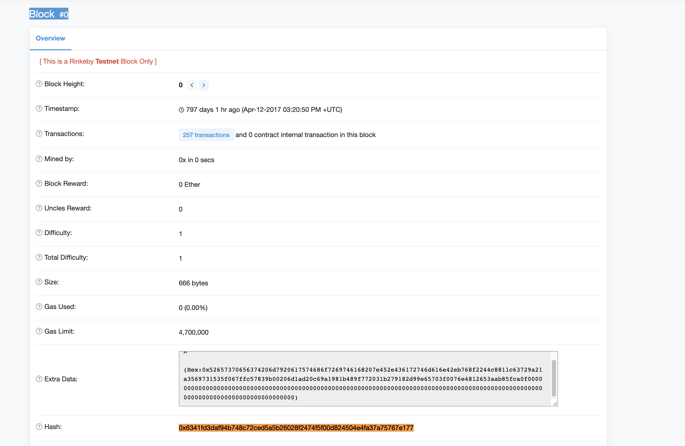

# Ejercicio 3 (2 puntos)

> Inicie la sincronización de la red Rinkeby en su dispositivo (se recomienda ésta frente a
> Ropsten debido al tamaño de la misma y la velocidad de sincronización).
>
> Para la realización de este ejercicio no necesita una sincronización completa del nodo.
>
> - Obtenga el address correspondiente al bloque génesis de la red Rinkeby mediante
> la consola del cliente Geth y demuestre cómo lo ha obtenido. No use la función
> getBlock(...).
> - Obtenga sólo la cantidad de peers a los que está conectado. Demuestre cómo lo
> ha obtenido.
> - Obtenga información acerca de los peers a los que está conectado e indique el
> hash del bloque actual de éstos.
> - Añada manualmente mediante la consola de Geth un bootnode de la red Rinkeby.
>
> Entrega: Puede entregar un documento .md donde se encuentre tanto la instrucción
> utilizada como la respuesta en consola. Si lo prefiere puede utilizar pantallazos y hacer
> referencia en ese mismo documento .md.


En primer lugar vamos a iniciar la sincronización con la red Rinkeby:

```
$ geth --rinkeby console
INFO [06-18|16:04:45.604] Maximum peer count                       ETH=25 LES=0 total=25
INFO [06-18|16:04:45.626] Starting peer-to-peer node               instance=Geth/v1.8.27-stable/darwin-amd64/go1.12.4
INFO [06-18|16:04:45.626] Allocated cache and file handles         database=/Users/molina/Library/Ethereum/rinkeby/geth/chaindata cache=512 handles=5120
INFO [06-18|16:04:45.670] Writing custom genesis block
INFO [06-18|16:04:45.679] Persisted trie from memory database      nodes=355 size=51.91kB time=1.842021ms gcnodes=0 gcsize=0.00B gctime=0s livenodes=1 livesize=0.00B
INFO [06-18|16:04:45.679] Initialised chain configuration          config="{ChainID: 4 Homestead: 1 DAO: <nil> DAOSupport: true EIP150: 2 EIP155: 3 EIP158: 3 Byzantium: 1035301 Constantinople: 3660663  ConstantinopleFix: 4321234 Engine: clique}"
INFO [06-18|16:04:45.680] Initialising Ethereum protocol           versions="[63 62]" network=4
INFO [06-18|16:04:45.688] Loaded most recent local header          number=0 hash=6341fd…67e177 td=1 age=2y2mo2w
INFO [06-18|16:04:45.688] Loaded most recent local full block      number=0 hash=6341fd…67e177 td=1 age=2y2mo2w
INFO [06-18|16:04:45.688] Loaded most recent local fast block      number=0 hash=6341fd…67e177 td=1 age=2y2mo2w
INFO [06-18|16:04:45.689] Regenerated local transaction journal    transactions=0 accounts=0
INFO [06-18|16:04:45.701] Stored checkpoint snapshot to disk       number=0 hash=6341fd…67e177
INFO [06-18|16:04:45.729] New local node record                    seq=1 id=5f731a2d8bca106c ip=127.0.0.1 udp=30303 tcp=30303
INFO [06-18|16:04:45.730] Started P2P networking                   self=enode://a63816ba56dd71e52c331e589d66530b06cabeee417f5a6fd3f83b6cf9258f1cb3e49fd6e8c1ec1b4cc7e74dde3c02f17a756f196a0e286349388b2d677d22ea@127.0.0.1:30303
INFO [06-18|16:04:45.732] IPC endpoint opened                      url=/Users/molina/Library/Ethereum/rinkeby/geth.ipc
Welcome to the Geth JavaScript console!

instance: Geth/v1.8.27-stable/darwin-amd64/go1.12.4
 modules: admin:1.0 clique:1.0 debug:1.0 eth:1.0 miner:1.0 net:1.0 personal:1.0 rpc:1.0 txpool:1.0 web3:1.0

> INFO [06-18|16:04:48.607] New local node record                    seq=2 id=5f731a2d8bca106c ip=37.11.138.20 udp=30303 tcp=30303
INFO [06-18|16:04:55.734] Block synchronisation started
INFO [06-18|16:04:59.139] Imported new block headers               count=192 elapsed=60.374ms number=192 hash=8c570c…ba360c age=2y2mo2w
INFO [06-18|16:04:59.146] Imported new block receipts              count=54  elapsed=394.873µs number=54  hash=dafe6e…02bf13 age=2y2mo2w size=216.00B

...
```


A continuación vamos a obtener los datos del ejercicio:

- Hash del bloque génesis:

```
> admin.nodeInfo

{
  enode: "enode://a63816ba56dd71e52c331e589d66530b06cabeee417f5a6fd3f83b6cf9258f1cb3e49fd6e8c1ec1b4cc7e74dde3c02f17a756f196a0e286349388b2d677d22ea@37.11.138.20:30303",
  enr: "0xf896b840b92af6bd8421c6c28baf9caf1eb0ab6a2897faf42862eabde82fcbf549eef1273d1da54f8d8c5015f6a1c781cef67473ddd66cc79d210a7655b2709ef020e85e0883636170c6c5836574683f82696482763482697084250b8a1489736563703235366b31a102a63816ba56dd71e52c331e589d66530b06cabeee417f5a6fd3f83b6cf9258f1c8374637082765f8375647082765f",
  id: "5f731a2d8bca106c80e8569d2ccdf7462a9042778a86cf13d044104a7442ded1",
  ip: "37.11.138.20",
  listenAddr: "[::]:30303",
  name: "Geth/v1.8.27-stable/darwin-amd64/go1.12.4",
  ports: {
    discovery: 30303,
    listener: 30303
  },
  protocols: {
    eth: {
      config: {
        byzantiumBlock: 1035301,
        chainId: 4,
        clique: {...},
        constantinopleBlock: 3660663,
        daoForkSupport: true,
        eip150Block: 2,
        eip150Hash: "0x9b095b36c15eaf13044373aef8ee0bd3a382a5abb92e402afa44b8249c3a90e9",
        eip155Block: 3,
        eip158Block: 3,
        homesteadBlock: 1,
        petersburgBlock: 4321234
      },
      difficulty: 1,
      genesis: "0x6341fd3daf94b748c72ced5a5b26028f2474f5f00d824504e4fa37a75767e177",
      head: "0x6341fd3daf94b748c72ced5a5b26028f2474f5f00d824504e4fa37a75767e177",
      network: 4
    }
  }
}
```

Se puede apreciar que el hash del bloque génesis es _"0x6341fd3daf94b748c72ced5a5b26028f2474f5f00d824504e4fa37a75767e177"_.

Si miramos en Etherscan vemos que así es:



 
- Número de nodos a los que estamos conectados:

```
> net.peerCount
6
```

- Información sobre los peers:

```
> admin.peers
[{
    caps: ["eth/62", "eth/63"],
    enode: "enode://343149e4feefa15d882d9fe4ac7d88f885bd05ebb735e547f12e12080a9fa07c8014ca6fd7f373123488102fe5e34111f8509cf0b7de3f5b44339c9f25e87cb8@52.3.158.184:30303",
    id: "1aabba770181eef1b399df4e4177cfc797a1ef5efb0bf961f455c6cab30bee5f",
    name: "Geth/v1.9.0-unstable-2da6d1e0-20190613/linux-amd64/go1.12",
    network: {
      inbound: false,
      localAddress: "192.168.1.134:64613",
      remoteAddress: "52.3.158.184:30303",
      static: false,
      trusted: false
    },
    protocols: {
      eth: {
        difficulty: 8393315,
        head: "0x0da9619483074fc3ee55fb5edc2c305b84950c9531f59724884fc83dcc934e63",
        version: 63
      }
    }
}, {
    caps: ["eth/62", "eth/63"],
    enode: "enode://13db07c07cf684a44b73f501a8bcc5a70d3ffdca2100015244fcef528983ba4e44a6f6d9ba32ea03b145a5fba0e4f4c78e521a3b7455001aac7908ad818d5f96@31.210.75.173:57786",
    id: "4740c1f76191c17f65a0d3819066a7aefdf2069763aa5df5de7dab27af6f4771",
    name: "Geth/v1.8.27-stable-4bcc0a37/windows-amd64/go1.11.5",
    network: {
      inbound: true,
      localAddress: "192.168.1.134:30303",
      remoteAddress: "31.210.75.173:57786",
      static: false,
      trusted: false
    },
    protocols: {
      eth: {
        difficulty: 8393431,
        head: "0x4f2989be8710c7024608b58c79e36275ee0799693e36115e87afe246bee82983",
        version: 63
      }
    }
}, {
    caps: ["eth/62", "eth/63", "les/1", "les/2"],
    enode: "enode://97cb015ee7cb8b767a5c02d9ec57a3bbc8d8861d081c8a0dadb1ebee23a9493efc6d8a4065250ac8964ef7fee54fc2ce817ddc20c1a6c27d548b89df25cbbfc7@207.154.192.173:45254",
    id: "4ce167513204a965c4eddc4761bf3e1e1062083e026d10970a6a332eb50ec8be",
    name: "Geth/v1.8.27-stable-4bcc0a37/linux-amd64/go1.10.4",
    network: {
      inbound: true,
      localAddress: "192.168.1.134:30303",
      remoteAddress: "207.154.192.173:45254",
      static: false,
      trusted: false
    },
    protocols: {
      eth: {
        difficulty: 8393423,
        head: "0x319b3f12a76db1f21f6f1c318ba12f6bc703a5cccb3f9d3f7d8e61f0992894cc",
        version: 63
      }
    }
}, {
    caps: ["eth/62", "eth/63"],
    enode: "enode://29257edee5da79f84198184f4e845c3d08f5ecc7a445b64ea696d56fb2e3deb5005ffc0e81420ba2579725d2a21b4f5d1c5dbe2f766db37806d2b7d5c926dfbc@138.68.78.152:53266",
    id: "65d177653ddaca45a25c5448e60d5c777f2eb82cc8929001d38a46cecf5a2909",
    name: "Geth/v1.8.27-stable-4bcc0a37/linux-amd64/go1.10.4",
    network: {
      inbound: true,
      localAddress: "192.168.1.134:30303",
      remoteAddress: "138.68.78.152:53266",
      static: false,
      trusted: false
    },
    protocols: {
      eth: {
        difficulty: 8393437,
        head: "0xd641cbbfee17481af62c9484b4004451fc16efa6d7b5b034ef463df336c4bfb8",
        version: 63
      }
    }
}, {
    caps: ["eth/63"],
    enode: "enode://11117fcbb6c911b24e669d797ca06c7d912f26f46a8e9ba287ea4e31a7b5fd8596bc3da0b08225cf0ed01463359be5b5c2425563e7c85e84672d6cb0731a7ca1@188.27.128.107:40580",
    id: "aaf59069b8cb883c8cd6e2d5a6ce6d4f0a123dc2f6d320d7f19cb0b5e1e3fcfc",
    name: "Geth/v1.9.0-unstable/linux-amd64/go1.12.5",
    network: {
      inbound: true,
      localAddress: "192.168.1.134:30303",
      remoteAddress: "188.27.128.107:40580",
      static: false,
      trusted: false
    },
    protocols: {
      eth: {
        difficulty: 8393361,
        head: "0x5a53fa99423c9143dcd432882f3e602ffda8584242545d08049aa13f728769f0",
        version: 63
      }
    }
}, {
    caps: ["eth/62", "eth/63"],
    enode: "enode://6b20d2837ff853ec0da2502ec4a15ae52ba03c92ef95e0d1d2e0ad1e39a31aa25b6b8e9bd816a50007f41a0300c02ab08f157f37a17999a60cb786a76293348c@74.125.182.5:54526",
    id: "c1566768d63e63475835440cfc2e4e0e2313f52687e250c02c1d082f7be1437d",
    name: "Geth/v1.8.27-stable/linux-amd64/go1.12.5",
    network: {
      inbound: true,
      localAddress: "192.168.1.134:30303",
      remoteAddress: "74.125.182.5:54526",
      static: false,
      trusted: false
    },
    protocols: {
      eth: {
        difficulty: 8325758,
        head: "0xc3d57f8fe8c5b2fe52794832c74877abad0494ff4386c0b51b63806db5920cd5",
        version: 63
      }
    }
}, {
    caps: ["eth/62", "eth/63", "par/1", "par/2", "par/3"],
    enode: "enode://60b8034b55e72c11b8b1f7c2054c83cf1a03a249c00b4848ba2af717302abdb4e0ee043572d3300e00d6e8d6e905fe2f6ad17797b5275a7886339d668473bb87@3.212.30.78:55980",
    id: "ce3871774aba3381263e7f87f81658b84c06fa6d4e39b5a80bdc4b77383d3ddd",
    name: "Parity-Ethereum/v2.5.1-beta-adabd81-20190514/x86_64-linux-gnu/rustc1.34.1",
    network: {
      inbound: true,
      localAddress: "192.168.1.134:30303",
      remoteAddress: "3.212.30.78:55980",
      static: false,
      trusted: false
    },
    protocols: {
      eth: {
        difficulty: 8393437,
        head: "0xd641cbbfee17481af62c9484b4004451fc16efa6d7b5b034ef463df336c4bfb8",
        version: 63
      }
    }
}]
```

El hash del bloque actual de cada peer viene dado en el parámetro `protocols.eth.head`.


- Añadir un bootnode de Rinkeby:

```
> admin.addPeer('enode://343149e4feefa15d882d9fe4ac7d88f885bd05ebb735e547f12e12080a9fa07c8014ca6fd7f373123488102fe5e34111f8509cf0b7de3f5b44339c9f25e87cb8@52.3.158.184:30303')
true
```

En este caso hemos añadido el bootnode de infura.
